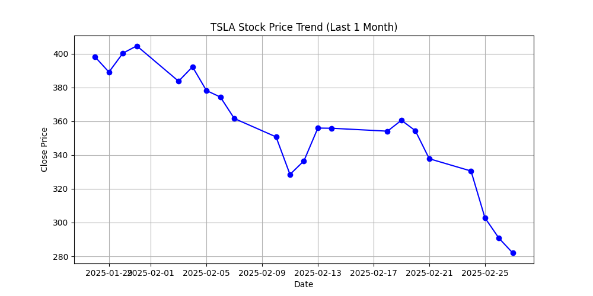
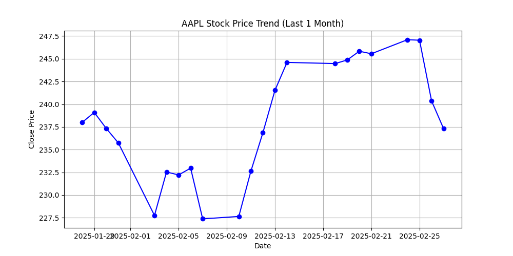
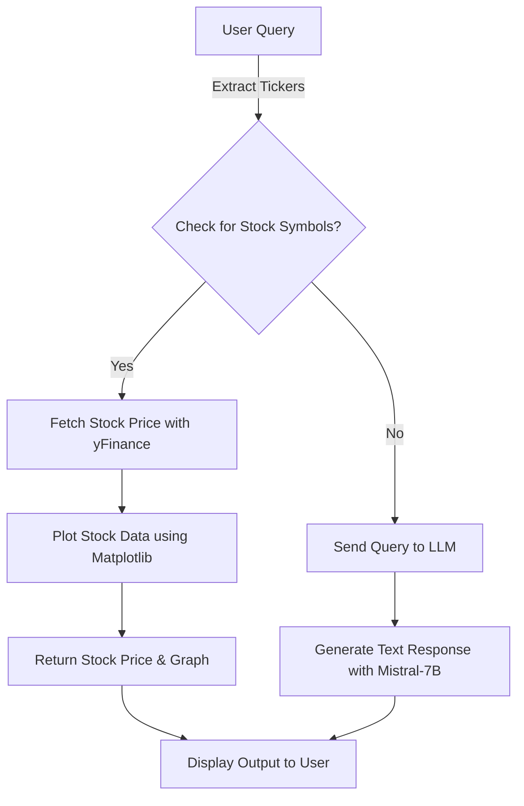

# AI-Stock-agent

---

```md
# AI Stock Agent (Mistral-7B)  

## 🚀 Project Overview  
This AI-powered stock market assistant can:  
- Fetch real-time stock prices using `yfinance`  
- Generate stock trend visualizations using `matplotlib`  
- Answer general financial questions using `Mistral-7B`  
- Provide an interactive UI inside Google Colab  

---

## ⚙️ Setup & Installation  

### 1️⃣ Open Google Colab  
Click here to launch: **[Colab Notebook](https://colab.research.google.com/drive/1tCbhyM9pBXGE2lyY6X6_sjopD4Y3YncA?usp=sharing)**  

### 2️⃣ Install Dependencies  
Run this inside Colab:  
```sh
!pip install transformers accelerate bitsandbytes torch sentencepiece langchain langgraph yfinance matplotlib ipywidgets
```

### 3️⃣ Enter Your Hugging Face Token  
When prompted, enter your **Hugging Face API Token** to access Mistral-7B.  

### 4️⃣ Run the Notebook  
- Run all cells in order.  
- Use the interactive chat UI to ask stock-related queries.  

---

## 📝 How to Use  
1. Enter a query in the text box  
   **Example:**  
   ```
   Stock price of TSLA and AAPL
   ```
2. Press Enter & get results  
   **Example Output:**  
   ```
   Current price of TSLA: $281.95  
   Plot saved as TSLA_plot.png  

   Current price of AAPL: $237.30  
   Plot saved as AAPL_plot.png  
   ```
3. For general queries, ask like this:  
   ```
   What is machine learning?
   ```
   **Example Output:**  
   ```
   Machine learning is a type of AI that allows computers to learn from data...
   ```

---

## 📊 Example Stock Charts  
| TSLA | AAPL |  
|------|------|  
|  |  |  

---

## 🔁 System Workflow  


---

## 🎥 Demo Video  
Watch the demo: **[Demo Video Link](https://drive.google.com/file/d/18X2zLuiuZBRBdI1kytPnYEb6101qtTtk/view?usp=sharing)**  

---

## 🛠 Tech Stack  
- **Python**  
- **LangGraph** (for multi-agent processing)  
- **Mistral-7B** (for natural language understanding)  
- **yFinance** (for real-time stock data)  
- **Matplotlib** (for stock trend visualization)  
- **Google Colab** (for interactive UI)  

---

## 🤝 Contributing  
Feel free to **fork** & **improve** the project.  

---

## 📩 Contact  
📧 **Email:** kavyakapoor869@gmail.com  
🌐 **GitHub:** [Your GitHub Profile](https://github.com/kavyakapoor200)  
```

---
